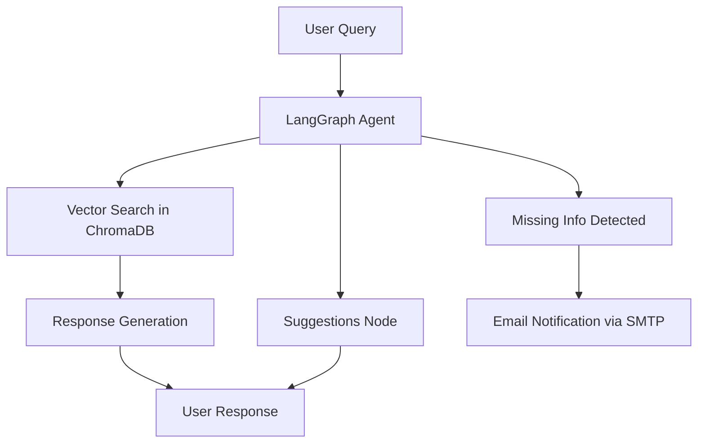

# CVBot Backend

A sophisticated **AI-powered personal assistant backend** designed to provide seamless access to your professional profile through **intelligent document retrieval**, **context-aware responses**, and **proactive suggestions**.

## 🚀 Features

- **Intelligent Agent (LangGraph)**  
  Retrieves relevant information from your documents and alerts you when knowledge gaps are detected.
- **Suggestions Engine**  
  Generates follow-up or suggested questions to guide more effective interactions.
- **Document Processing**  
  Advanced OCR and text pipeline supporting multiple file formats with smart chunking.
- **Vector Search**  
  Efficient semantic retrieval with **ChromaDB**.
- **Notifications**  
  Automatic email alerts sent via **SMTP** when missing or incomplete information is found.
- **File Management**  
  Full CRUD support for documents in the vector database.
- **API Tracing & Monitoring**  
  Powered by **Opik** for observability and debugging.

## 🛠️ Tech Stack

- **Framework**: FastAPI
- **Agent**: LangGraph
- **Database**: PostgreSQL + ChromaDB (vector storage)
- **Cache / Rate Limiting**: Redis
- **Authentication**: Clerk
- **OCR**: Docling + EasyOCR
- **Monitoring**: Opik
- **Language**: Python
- **Email Notifications**: SMTP

## 📋 Architecture

### Document Processing Pipeline

1. **File Upload** – PDF files processed with **Docling** for OCR extraction.
2. **Markdown Conversion** – Unified content representation.
3. **Smart Chunking** – Content split by headings and intelligently chunked with an LLM.
4. **Context Enhancement** – Each chunk enriched with surrounding context.
5. **Vector Embedding** – Enhanced chunks stored in **ChromaDB** for semantic retrieval.

### Agent Workflow

- **Query Processing** – User queries handled by the LangGraph agent.
- **Vector Search** – Relevant embeddings retrieved from ChromaDB.
- **Response Generation** – Professional, contextually accurate responses produced.
- **Suggestions Node** – Asynchronous node that generates **question suggestions** to improve user interaction.
- **Notification System** – Missing information triggers **email notifications via SMTP**.

## 🛤️ Project Routes

The CVBot Backend exposes modular routes under `/api/v1`:

- **/vector-store** – Manages documents in the vector DB.
  - `POST /vector-store/store-files`: Upload & process documents.
  - `POST /vector-store/semantic-search`: Perform semantic search.
  - `GET /vector-store/retrieve-files`: List processed files.
  - `GET /vector-store/retrieve-embeddings?filename=...`: Retrieve embeddings for a file.
  - `DELETE /vector-store/delete-files`: Remove files.

- **/projects** – Manage portfolio projects.
  - `GET /projects`: List all projects.
  - `POST /projects`: Add new project.
  - `DELETE /projects/{project_id}`: Delete project by ID.

- **/chatbot** – AI chatbot interaction.
  - `POST /chatbot/invoke`: Send a message to the AI agent. (**Rate limited: 20 req/min per user**)
  - `GET /chatbot/history?session_id=...`: Retrieve session history.

---
**`vector-store` and `projects` routes are secured with Clerk authentication.**

---

## 📊 Monitoring

- Tracing & monitoring with **Opik** for reliable performance and debugging.

## 🔍 Document Processing Details

### Supported File Formats
- **PDF**: Processed with Docling (OCR support).
- **Markdown**: Directly processed.

### Chunking Strategy (Inspired by [Anthropic's Contextual Retrieval](https://www.anthropic.com/news/contextual-retrieval))
1. **Heading-based Split** – Structural splitting.
2. **LLM-powered Chunking** – Optimized chunk sizes.
3. **Context Addition** – Enriched with surrounding text.
4. **Semantic Embedding** – Converted to vectors for similarity search.

## 🤖 Agent Capabilities

The LangGraph-powered agent provides:
- Semantic search through professional documents.
- Contextual answers about experience & skills.
- Identification of knowledge gaps with **SMTP email alerts**.
- Conversation context maintenance for seamless dialogue.
- Professional, tailored responses.
- Suggested follow-up questions for improved engagement.

## 🔐 Security

- **Authentication**: Clerk-based authentication.
- **API Security**: Redis-based rate limiting & strict input validation.

## 💻 Installation

1. Navigate to the `deployment` folder.
2. Copy `.env.example` → `.env` and configure environment variables (incl. Redis & SMTP).
3. Run `docker compose up` to start services (includes Redis).
4. Containers initialize; **NGINX** exposes port `80` → host `8081` (configurable).
5. Access via `localhost:8081` or a reverse proxy.

## 👨‍💻 Author

Originally built by [Kaloyan Stefanov](https://github.com/ikok07).